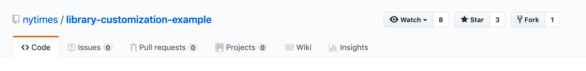
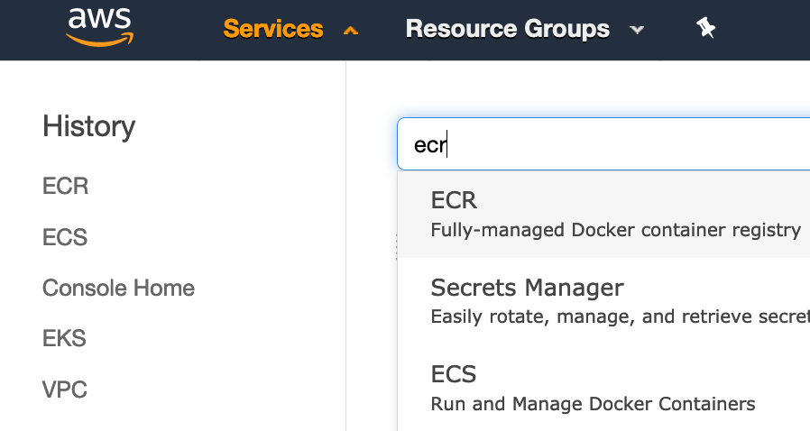
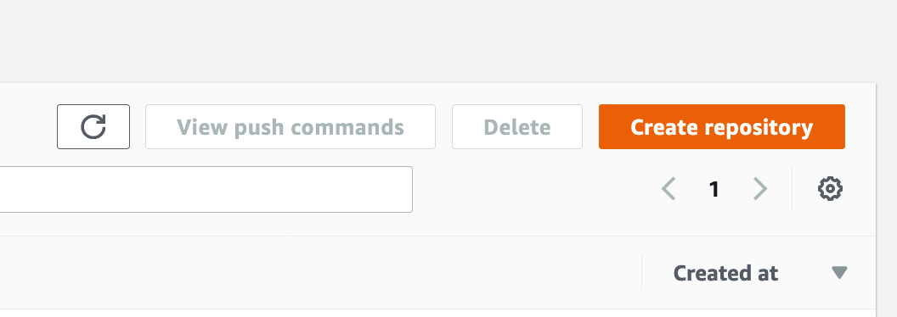
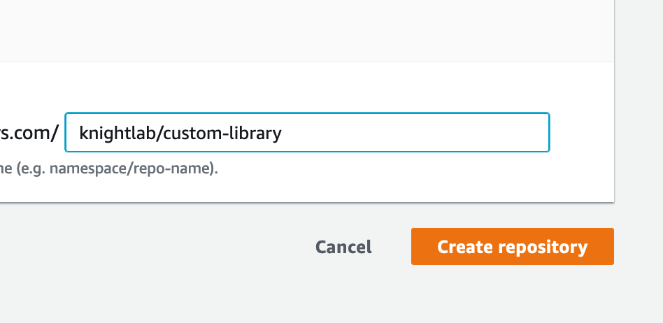
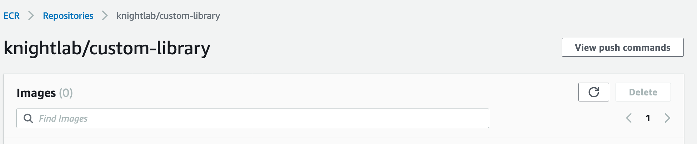
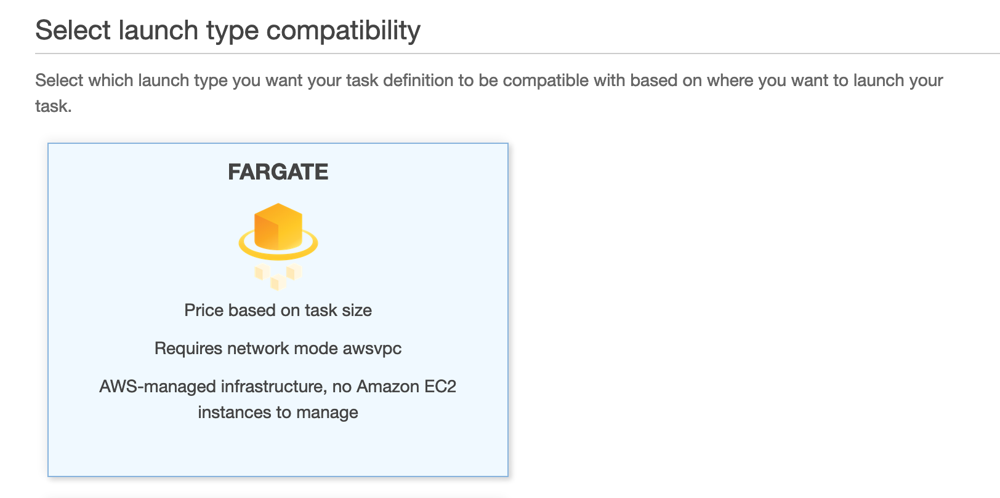
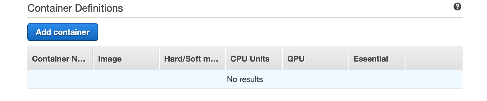
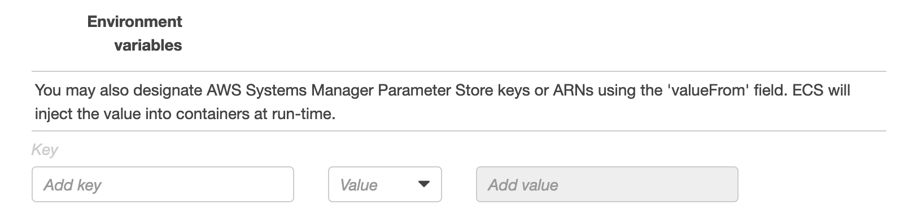
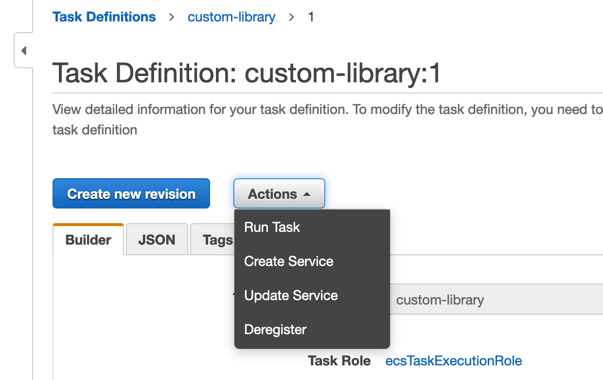

# Running a custom Library instance in AWS ECS Fargate

To run Library in ECS:

 * Fork the GitHub repo
 * Create an ECR repository
 * Build and push the repository
 * Create the task definition
 * Run the task

See below for more detail.

## Fork the Github repo

The Library customization example repository demonstrates how to create a customized version of Library that is build from the NYT Library Docker image. The primary difference between that example and what we are doing here is that we will not use Docker Compose.

The first step is simply to clone the customization repository.

https://github.com/nytimes/library-customization-example




## Dockerfile

You may need to tweak the Dockerfile. We removed the v1-alpha tag reference.

```
FROM nytimes/library

COPY . ./custom/
WORKDIR /usr/src/tmp
COPY package*.json ./
RUN npm i
RUN yes | cp -rf ./node_modules/* /usr/src/app/node_modules
WORKDIR /usr/src/app
RUN npm run build
CMD [ "npm", "run", "start" ]
```

## package.json

We are not using Docker compose in ECS, so the package.json file needs the appropriate scripts. We just copied those from the main repo: https://github.com/nytimes/library/blob/master/package.json.

Additional needed dependencies should also be defined here.

```
{
  "name": "knightlab-library-customization",
  "version": "1.0.0",
  "description": "Knightlab custom Library instance",
  "main": "index.js",
  "scripts": {
    "start": "node server/index.js",
    "build": "node-sass --include-path custom/styles --include-path styles/partials --source-map public/css/style.css.map --source-map-contents styles/style.scss public/css/style.css"
  },
  "repository": {
    "type": "git",
    "url": "https://github.com/NUKnightLab/library-customization-example"
  },
  "author": "Knight Lab",
  "license": "Apache-2.0",
  "bugs": {
    "url": "https://github.com/nytimes/library-customization-example/issues"
  },
  "homepage": "https://github.com/nytimes/library-customization-example#readme",
  "dependencies": {
    "cache-manager-ioredis": "^1.0.1",
    "express-sslify": "^1.2.0"
  }
}
```

## Create the ECR repository

ECR is the container repository service counterpart to AWS ECS. It is possible to use a different repository service, but using ECR is the easiest way to get started in ECS.

Note that there is a distinction here between the container repository and the code repository. Even though your code is revision controlled in GitHub, you still need to host the built Docker container in a container repository. That is the role of ECR -- ECS will pull the build container from ECR when it comes time to execute the task.

Select the ECR service in the AWS console.



Select `Create repository`.



Name the repostory. Optionally provide a namespace as we have done here with `namespace/repository-name`.



Now you will need to build and push up an image of the Docker container into this repository. Select the newly created repository from the ECR repositories list and select `View push commands`


Inside your clone of the cusomization repo, follow the provided push commands. Note, you will need to have the AWS CLI intalled with credentials configured. ECR uses a login process from your credentials configurations. The push commands will look something like this:

```
$(aws ecr get-login --no-include-email --region us-east-1)
docker build -t knightlab/custom-library .
docker tag knightlab/custom-library:latest some-id.dkr.ecr.some-region.amazonaws.com/knightlab/custom-library:latest
docker push some-id.dkr.ecr.some-region.amazonaws.com/knightlab/custom-library:latest
```

Be sure to use the push commands specific to your ECR repository. Note that if you have multiple accounts configured in your AWS credentials, you can pass a --profile parameter to the get-login command.

This process will build the Docker container, tag it as latest, and push it up to your private ECR.

## Create the Task Definition

Tip: Before you leave the ECR panel, copy the repository image path into your clipboard. You will need it below. It looks somthing like this:

some-id.dkr.ecr.some-region.amazonaws.com/knightlab/custom-library

From the ECS panel, select Task Definitions > Create new Task Definition.


Select the Fargate launch type, and Next step.



You will now define the task as well as the properties of the container. Note that resources specified below (Memory, CPU, etc) are somewhat arbitrary. We have started small and can easily rebuild our task definition and spin up a new task.

Note the use of port 80 here. As far as I can tell, there is not a way to map an arbitrary port in the container to a public port. Rather, with Fargate, you are simply defining which ports to expose and what the protocol is on that port. As a result, we have also defined `PORT=80` in the configuration environment variables for Library. Note that we use an https proxy, which is why port 80 works for us. You may need to expose port 443, but setting up the relevant SSL certs is currently not covered here.

Fill out:

 * Task Defintion Name
 * Task Role (ecsTaskExecutionRole -- you may need to create this in IAM)
 * Task Execution Role (ecsTaskExecutionRole)
 * Task Memory 0.5GB
 * Task CPU (vCPU) 0.25 vCPU

Select Add container



Fill out:

 * Container name
 * Image: You will need to go back to your ECR panel and copy this (Note to AWS team: it would be super helpful if you gave us a selector here)
 * Private repository authentication: Leave this unselected - we are not using this.
 * Memory soft limit: 300
 * Memory hard limit: 500
 * Port mapping: 80 (tcp)

Under the Advanced Container Configuration, find the Environment variables section. You will need to add the environment variables that would normally go into your .env file.



We have the following variables defined:

 * APPROVED_DOMAINS
 * DRIVE_ID
 * DRIVE_TYPE
 * GCP_PROJECT_ID
 * GOOGLE_APPLICATION_CREDENTIALS
 * GOOGLE_APPLICATION_JSON
 * GOOGLE_CLIENT_ID
 * GOOGLE_CLIENT_SECRET
 * NODE_ENV
 * PORT
 * SESSION_SECRET

Note PORT is set to 80. GOOGLE_APPLICATION_CREDENTIALS is parse_json, and GOOGLE_APPLICATION_JSON is the whole JSON string, -- we are not using an external auth.json file here.

Select `Add`

Once you have configured the Task defintion and it's container configs, select Create to create the task definition. This should successfully launch the task definition and its cloud watch log group.

## Run the task

From the console of the new task definition, select Actions > Run Task



Select:

 * Launch type: FARGATE
 * Platform version: Latest
 * Cluster: default
 * Number of tasks: 1
 * Cluster VPC: EC2ContainerService-default
 * Subnets: select available subnet(s)
 * Security group: use the automatically created security group
 * Auto-assign public IP: Enabled

Select Run Task

The task will show Provisioning, then with refreshes Pending, and eventually Running. Click through to the running task where you can get the Public IP address.

## Domain management

Since you won't know the IP address until the task is running, you really need to have some kind of domain setup. We use Cloudflare, which simply allows us to add the newly minted IP as a subdomain A record.

Once you have the domain setup (it should match your APPROVED_DOMAINS setting), you should see your running Library instance.

## Troubleshooting

You can get to the logs of your running task via:

ECS > Clusters > default > Tasks tab > Select task > Logs tab

